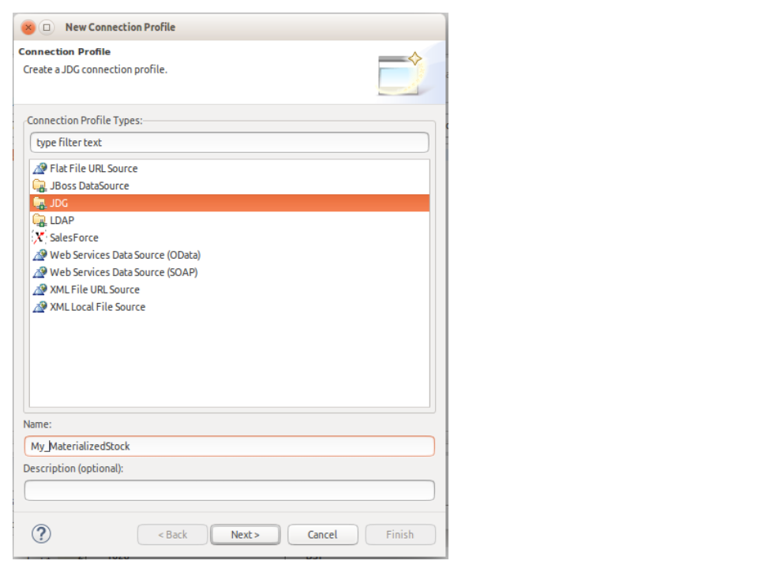
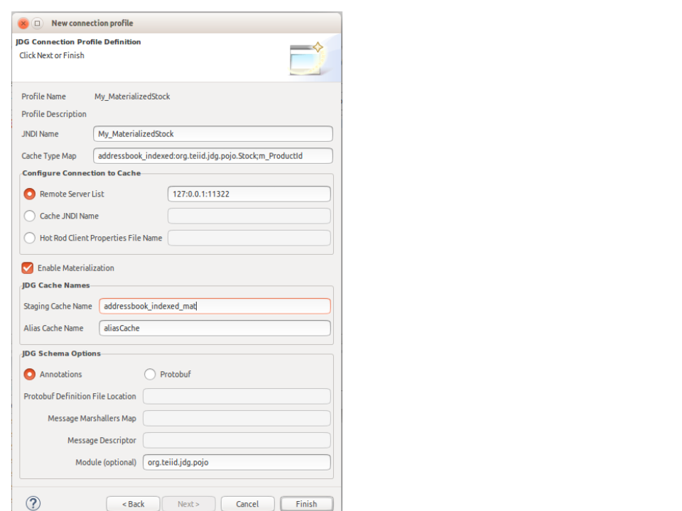

= JDG Connection Profile

The following are the steps thru creating a JDG Connection Profile.  This connection profile can then be used to create the resource adapter on the JDV server.

=== Select JDG Connection Profile option

=== Enter the JDG Resource Adapter properties

See https://teiid.gitbooks.io/documents/content/v/9.1.x/admin/Infinispan_HotRod_Data_Sources.html[Infinispan DSL (Hot Rod) DataSources] for additional clarification of the properties.

