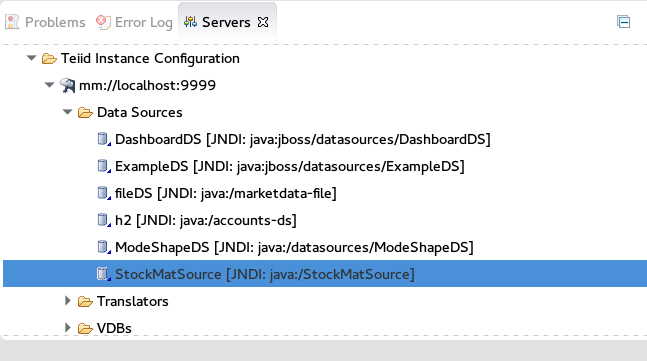

= Using Teiid Designer for Materialization

The following will describe the workflow for using Teiid Designer to create the artifacts needed to materialize a view into a JDG cache.
 
From a Teiid Designer perspective, a user will have views they wish to materialize and access via a JDG instance to return cached data rather than repeatedly access the data from the actual source.

The general workflow is as follows:

* Select, or Create View, that will be materialized
  . The View must have a primary key column that will be used as the primary key on the materialized table
  . Only simple pojo’s are supported for materialization.  see link:Limitations.adoc[Materialization Complex Objects]
  . Use native data types for the view columns

  NOTE:: to use complex data types, like big decimal, see link:Limitations.adoc[Protobuf Limitations using Complex Data Types]

* Right mouse click on selected view and then select *Materialize* option to link:Teiid_Materialize_View_Option.adoc[Generate JDG Source Tables, POJO and Module Zip]
  . Creates the JDG source model and a JDG staging table (i.e, prefixed with ST_ by default)
  . Creates POJO from selected relational table and columns
  .. Information will be needed in the next step to create connection profile

* Deploy POJO zip
 
  . Deploy pojo module to the server by unzipping at the root directory of the JDV installation.
  . If using pojo annotations, edit the module.xml for org.jboss.teiid.resource-adapter.infinispan.dsl resource adapter to add the pojo module dependency
Location:  modules/system/layers/dv/org/jboss/teiid/resource-adapter/infinispan/dsl/main/module.xml

[source]
.*Example module dependency*
----
<module name="{your.pojo.module.name}"  optional="true"  export="true" />
----
 
* Restart server

* Perform link:JDG_Connection_Profile.adoc[Create Connection Profile] to configure resource adapter
  . JDG Resource Adapter configured for materialization
  . Set JDG connection profile on JDG materialized source model

* Create data source from Connection Profile
** Verify data source was created by checking the server view

* Create VDB
  . Ensure the materialized view model and the JDG source model are added
  . Set translator type “infinispan-cache-dsl” on the JDG source model
  . For the JDG soure model, need the following translator overrides:
  .. SupportsDirectQueryProcedure = true
  .. SupportsNativeQueries = true

* Deploy VDB
* Test VDB
* Query the view that was materialized

