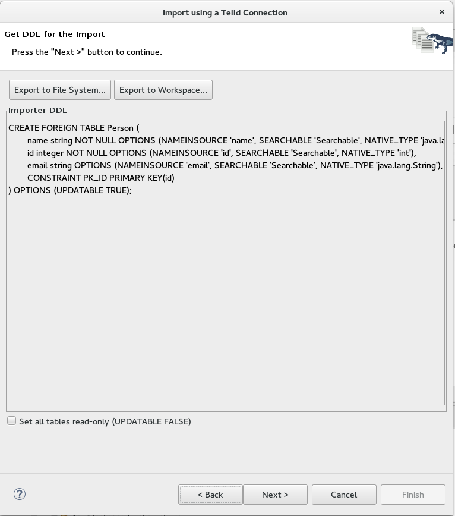

= Import JDG Metadata

To import JDG metadata to create the source model, use the Teiid Connection Importer.

The following are the steps to using the Teiid Connection Importer::

* 1) Select the Import --> Teiid Connection option

Press *Next* button to continue.

* 2) Select the JDG data source to be imported

Press *Next* button to continue.

* 3) Presented with import property options for importing

NOTE:  On this next dialog, be sure to change the translator to *infinispan-cache-dsl*.

Press *Next* button to continue.

* 4) Enter the name of what to call the new model

You can click on the advanced tab to see the VDB xml that will be used to import the metadata.

Press *Next* button

* 5) The DDL will be presented that will be imported from the JDG data source.

Press *Next* button

* 6) Presented a tree diagram of the table to be created

If you had configured the JDG resource adapter to have child pojo's, then will see an additional table for each configured child.

 
Press *Finished* to complete the import.

You should see the new model in the Model Explorer panel

