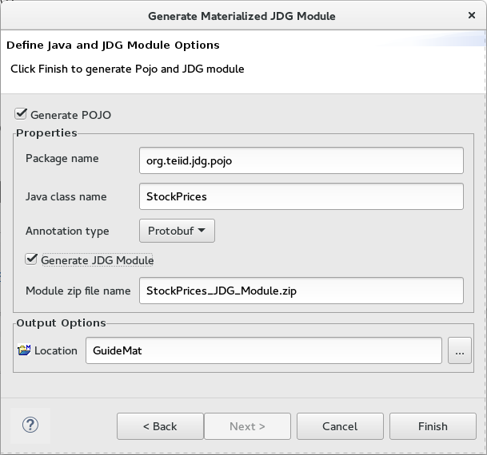

= Teiid Materialize View Wizard

== Performing this wizard will do the following:

*  Create the source tables, from the selected view, that will be the primary and staging source tables for the JDG caches
*  Create the pojo class, from the selected view, that wil be used to configure the JDG schema
*  Create the module zip that contains the pojo, to be deployed in the JDV server

*The following are the steps to perform *Materialize* wizard*

*  1)  Right click on selected view and select *Materialize* option

The following 1st dialog will be presented:

Can change the name of the new source model or the location to create it.

Press *Next* button to continue.

*  2)  Presented with JDG options to generate Pojo and create module deployment zip

**  Select option to Generate Pojo will create a pojo based on the view columns and their respective data types.

***  *Package Name*: can be changed and it also controls the name of the module, if choosen to be created.
***  *Java class name*: can be changed.  This controls what the name of the JDG Source tables that will be created.  The table and class name should match.  If you wish to rename the source table, create a view to change the name its exposed as.
***  *Annotation Type*: defaults to Protobuf, to create the pojo that contains protobuf annotations, used to configure the JDG schema.

**  3)  Select option to Generate JDG Module

Selecting this will indicate to package the pojo into a module zip using the entered name.  This can be used to deploy to the server by unzipping its contents at the JBOSS_HOME root directory.

Press *Finish* button to complete the generation process.

